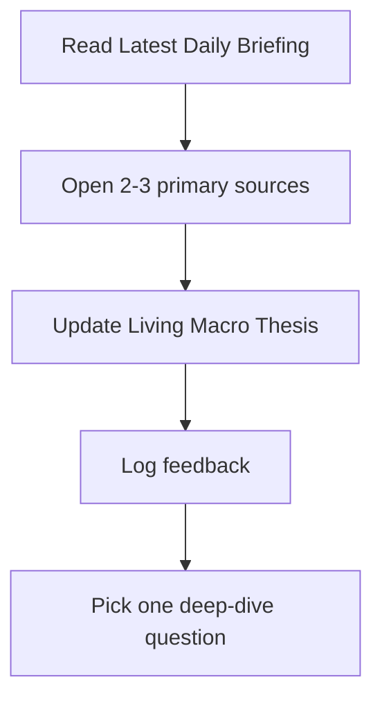

# News Operating System

## Daily Loop

## Core Research Lanes

| Lane | What To Watch | Why It Matters |
|---|---|---|
| AI infrastructure | Chips, data centers, power, cloud capex | Fixed investment, productivity, valuation risk |
| Consumer | Spending, jobs, wages, credit, housing | Growth durability and bifurcation |
| Geopolitics | Oil, sanctions, tariffs, shipping | Inflation volatility and risk premia |
| Industrials/Defense | Backlog, budgets, reshoring, aerospace | Long-cycle demand and fiscal support |
| Policy | Fed, CPI/PPI, yields, labor | Discount rates and market leadership |

## Active Notes

- [[Latest Daily Briefing]]
- [[Living Macro Thesis]]
- [[Feedback Log]]
- [[Source Library]]
- [[Automation Hub]]
